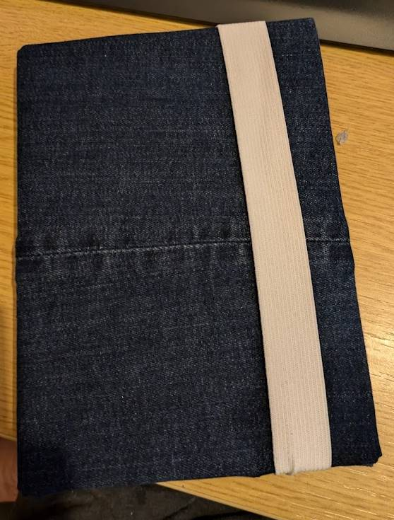

# The Jortbook | 16/12/2024
*No, Google, not "The Jokebook"*

`Hello World!`

Today I had the wonderful experience of ADHD hobby inducing, that is, the common experience among people with ADHD of picking up a new hobby almost randomly and hyperfixating on it for a period of time. Today, that  For me, that was the hobby of *book binding*, which lead me to creating my own crappy little notebook today which I'm quite proud of! That'll be the deeply enthralling tale of today's blog. This burst of inspiration has been building for a few days now I think, starting on Friday when I was at Salubrious' house (He has a blog too at [hypertheticalblog.blogspot.com](https://hypertheticalblog.blogspot.com/?m=1)!) looking at his beautiful leatherbound journal (pictured below). I was quite jealous of this journal and actually spent a little time looking on Ebay to buy my own, which I did actually do, specifically, I got [this](https://www.ebay.co.uk/itm/204337204935?itmmeta=01JF5DB8ZCM5CJG6FQ06JG9V3V&hash=item2f93724ec7:g:A4oAAOSwOtRhlspT) one. It's not arrived just yet but I may come back and update this to let you know my experience with the product, based on the reviews though it looks very nice.

That was four days ago now though, and today I was watching the [latest NerdForge video](https://www.youtube.com/watch?v=13coGQUp3ck) in which they make *huge* copies of their favourite book series including some absolutely incredible covers for them, I'll let you watch that video if you're interested. But anyways, that was the final straw in inspiring me to create my own, surely it couldn't be *that* difficult, right? wrong.

This sent me down my spiral of hyperfixation and forgetting to eat lunch until 4pm... First, I spent a while researching and trying to find the best way of doing it, rapidly giving me the impression that it may not be possible without some more specialist tools like a Bone Folder, Awl, Olfa Knife, and other words that sound like they're not from the English language. Fortunately I'm very special in the head and managed to either do without, or fashion my own versions of each of the tools I needed out of things I already had (we'll get to that in a little while). As well as tools, there were several materials I didn't have, Manufactured End Bands, I did without; Mull, I still don't know what it is; Waxed Linen Thread, I used some crappy twine that I had lying around instead.

The tutorial I eventually landed on following is [here](https://blog.papercraftpanda.com/tutorial-how-to-create-a-casebinding-part-i/), but I'll step through the process I used here as well, so you don't necessarily need to read that or anything to understand what I'm talking about here. The first step was to create the signatures, which I used 8 A4 sheets for each, folded in half to create 32 pages per signature to write on. I created 8 signatures in this way, making 256 pages total. I won't bore you with the actual sewing process here, but needless to say it was quite confusing considering I'd literally never done it before and was trying to just throw myself into it with an online tutorial, but this is where I made my first mistake, using too thin thread. This made life very difficult at first because it was very hard to tell where the thread was overlapping with other pieces of thread, it also wasn't particularly sturdy, making it very difficult to keep taught and hold the signatures together. It took me probably an hour or so to connect the first two signatures together with this thin sewing thread before I gave up, realising that it wasn't working and that I could literally put my entire hand in between the gaps in the threads holding the signatures together, I needed a different approach...

At first, I searched my room for any thread or twine that was thicker than what I had, but not too thick. Eventually accepting that the only stuff I had was a ball of thick gardening string that I'd picked up for some other project at some point. Naturally, my dainty little sewing needles were much too thick for this and absolutely wouldn't fit the string through (not that that stopped me from trying for half an hour), I needed a needle with a larger eye. Now I'd come to another tool which I needed but didn't have, and the tool I was referring to when I said that I'd "fashioned my own version". To do this, I took a wooden shish kebab skewer, sawed it down to a much shorter length with my craft knife, and slowly whittled out an eye from the blunt end whilst also sharpening the end to make it pierce the paper better. This took forever but eventually I got the eye big enough to fit the string through with the help of a needle threader. I still didn't have an awl at this point (a tool used to pre make the holes before threading through them with the needle) and my homemade needle would blunt very quickly given its material if I tried to use it to make holes in 8 sheets of paper at once. Instead, I used my original needle to make sort of "pilot holes" which I could then force the larger wooden needle through without blunting it too much, widening the hole. 

Now I could get back to actually sewing the pages together and making the book block (A term used to refer to the pages of the book which are sewn together into a single unit). This went relatively seamlessly besides for one step, step 13 of the "Create the Kettle stitch" section of the tutorial, which I wasn't really sure what it meant. That led to the 6th station of my book being almost entirely loose. Luckily this didn't end up being an issue because it was supported by the glue and the cover in the end, but it was certainly concerning at first and something I need to work out for next time I do this. And yes, there will definitely be a next time! I've already recieved a commission to make another one, more on that later! Anyways, I did eventually connect all 8 signatures into one text block.

This is where I strayed completely from the tutorial I was following, for better or for worse, and absolutely coated the spine in PVA glue to bond it together. I later found out that I was supposed to apply multiple thin coats (of course I was, it's always *two thin coats*), and this mistake led to the glue bleeding into the pages, making many of them stick together, the outer two pages rip off entirely from being sodden in glue, and generally turn the block into a mess. Luckily I was able to somewhat recover it, but there are certainly still signs of this unfortunate abuse I put it under.

Anyways, nonetheless, the book prevailed and I continued working on it once it had at least dried enough to continue working on it. The next step then was to create the cover! This was the most fun bit that I'd been looking forward to, because I knew exactly what I intended to do to this book to do it justice... First, I created a sort of "skeleton" using two sheets of balsa wood (I had no cardstock like the internet recommended for hardcover books) cut to size to cover the front and back of the book. I connected these two sheets using a piece of paper folded over the corners of the book to create the spine. Now, at long last I was able to do what I'd been looking forward to, which was to unseam my old jeans.

The idea was to create a denim cover for the book, which I achieved by cutting out a suitably sized rectangle of denim from the trouser leg, then wrapping and gluing it around the skeleton from the previous stage. This was a surprisingly simple process and before long I had a finished cover. All it needed now was to glue on the elastic and then the cover over the top and the book was finished!

The keen eyed will notice that in a previous picture and possibly in other places I referred to the Jortbook as the Jotebook, the less keen eyed will notice that Jotebook makes a lot more sense than Jortbook. The thing is though that I don't care and Jortbook sounds cooler so that's what you get.

I also mentioned that I had received a commission to create another Jortbook! That was from the original inspiration of the book himself, Sir Salubrious! Thank you very much and I'm glad you liked it, I'll begin work on yours as soon as possible, and hopefully, with some proper resources, it'll be even better than the first version!

I hope you appreciate the Jortbook as much as I do, but for now...

`Goodbye World!`